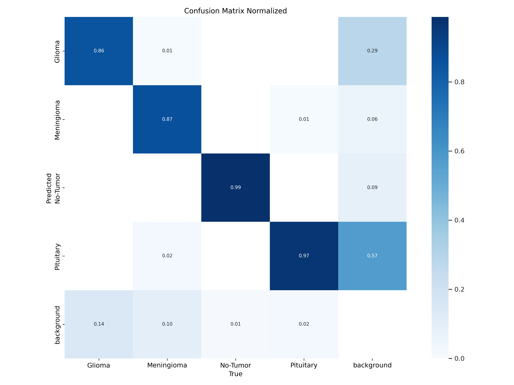
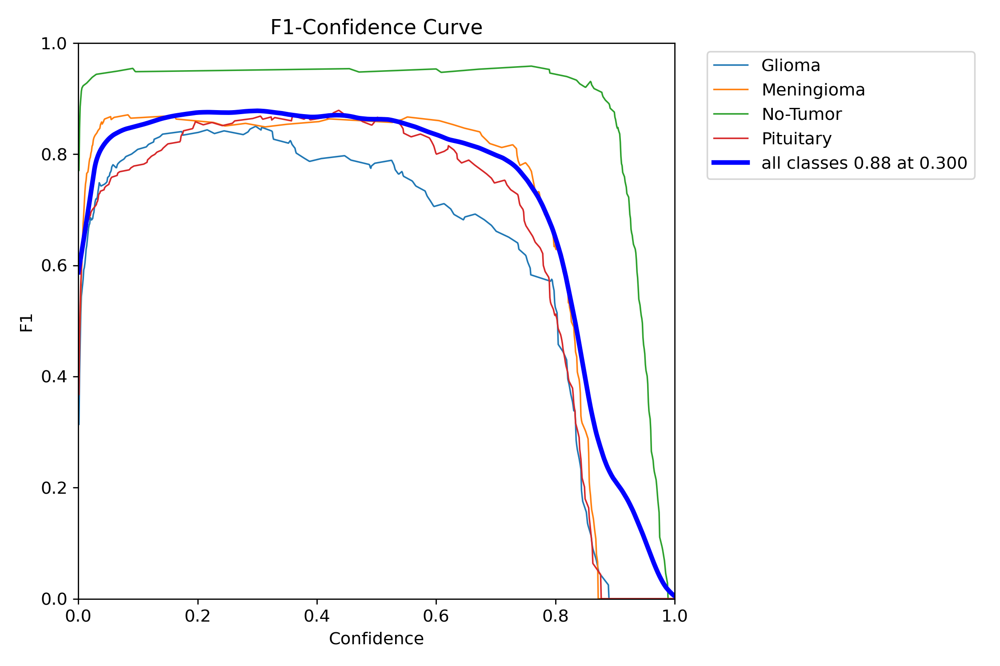
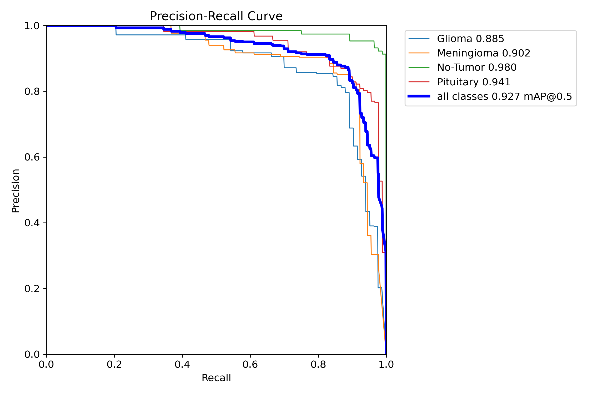
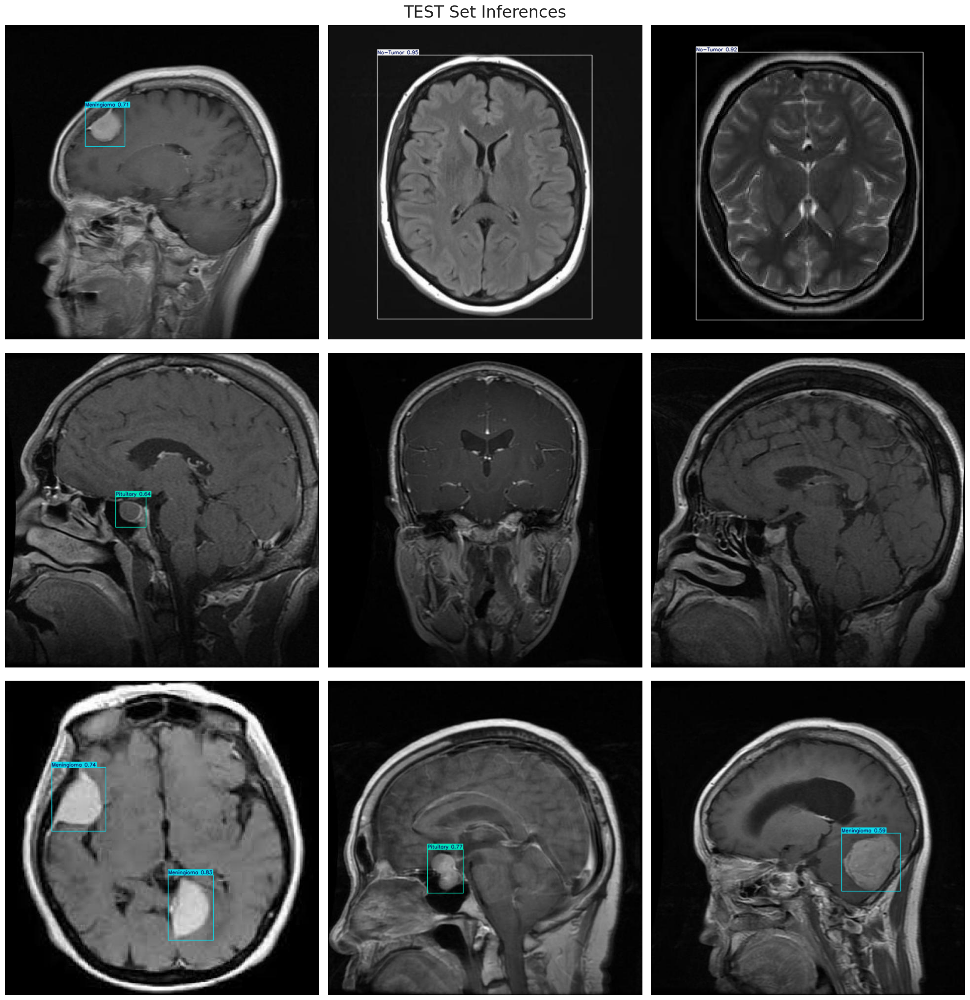

# YOLOv8 Brain Tumor Detection

## Project Description

This project uses YOLOv8 (You Only Look Once version 8) to detect brain tumors. YOLOv8 is a powerful object detection model known for its high accuracy and fast processing speed. This application aims to speed up the diagnosis process in healthcare by automatically detecting tumors in brain MRI images.

## Features

- Detects tumors in brain MRI images
- High accuracy with low false positive rate
- Real-time analysis and predictions
- Support for training and inference

## Performance

The performance of the model is demonstrated through the following visuals:

- **Normalized Confusion Matrix:**

    

- **F1 Score Curve:**

    

- **Precision-Recall Curve:**

    

- **Sample Detections:**

    

These visuals illustrate the model’s performance in detecting brain tumors, including confusion matrix, F1 score, precision-recall curve, and sample detections.

## Contributing

If you want to contribute, please follow these steps:

1. Fork the repository
2. Create a new branch (`git checkout -b feature/YourFeature`)
3. Make your changes and commit them (`git commit -am 'Add new feature'`)
4. Push your branch to GitHub (`git push origin feature/YourFeature`)
5. Create a Pull Request

## License

This project is licensed under the [MIT License](LICENSE). For more details, please refer to the license file.

## Contact

For questions or feedback, you can contact me:

- Email: [1tunadogan@gmail.com](mailto:1tunadogan@gmail.com)
- GitHub: [1tunadogan](https://github.com/1tunadogan)
